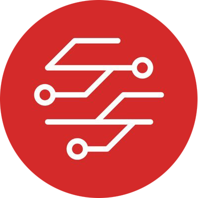

<p align="center">
  
  <h2 align="center">delineate.io</h2>
  <p align="center">portray or describe (something) precisely.</p>
</p>

## Purpose

Delineate is a platform for taking business ideas to end users without losing clarity of the orginal idea. This project will provide the core services for the delineate.io platform. Currently this repo only contains an example service which has been used to refine the developer workflow and tooling.

## Badges

[](https://circleci.com/gh/delineateio/delineateio.engine)
[](https://codebeat.co/projects/github-com-delineateio-delineateio-engine-master)
[](https://goreportcard.com/report/gtithub.com/delineateio/delineateio.engine)
[](https://github.com/delineateio/delineateio.engine/issues?q=is%3Aissue+is%3Aopen+label%3A%22good+first+issue%22+)
[](https://github.com/delineateio/delineateio.engine/releases)
[](https://opensource.org/licenses/MIT)

## Principles

* All dependencies are to be strongly versioned (e.g. image tags, package versions, tool versions) to mitigate any version drift that causes unexpected issues
* All sensitive keys are to be stored in an `/.env` directory so that they are excluded from being committed to the remote repo by .gitignore` rules
* All files related to a specific service are to be contained in a service sub directory in `./dev/services` to mitigate tight coupling
* Separation is to be maintained between the install and configuration of the `vagrant` machine to ensure reuse of Asible playbooks across projects
* Features will be delivered via configuration rather than scripts whenever possible

## Desktop Setup

### Overview

To make setup of the development environment as easy as possible a Hashicorp Vagrant file has been provided with an Ansible playbooks to install dependencies.  `vagrant` is the only mandatory pr-installed desktop software required to stand up a dev environment.

The IDE will be installed on host. Any IDE can be used although the `.vscode` directory has been committed tothe repo to enable sharing of settings between contributors.

### Secrets

Secrets are provisioned into the `vagrant` VM during Ansible provisioning, the following secrets should be present in `./vm/config/.env`:

|Group|File|Env Variables|Docs|
|---|---|---|---|
|Cloudflare|cloudflare.env|CLOUDFLARE_EMAIL, CLOUDFLARE_ZONE, CLOUDFLARE_TOKEN|[link](https://support.cloudflare.com/hc/en-us/articles/200167836-Managing-API-Tokens-and-Keys)|
|Snyk|snyk.env|SNYK_TOKEN|[link](https://support.snyk.io/hc/en-us/articles/360004037557-Authentication-for-API)|
|Git|git.env|GIT_NAME, GIT_EMAIL||

### Installed Components

The `vagrantfile` ensures that the following components are installed and configured correct to provide a fully formed developer desktop.

|Tool|Use|
|---|---|
|[Go](https://golang.org/)|Core `golang` and associated libraries
|[golangci-lint](https://golangci-lint.run/)|Fast application of multiple `golang` linters|
|[Git](https://git-scm.com/)|Source code management|
|[pre-commit](https://pre-commit.com/)|Framework for using `git` hooks|
|[Detect Secrets](https://github.com/Yelp/detect-secrets)|Integrates with `pre-commit` to mitigate secrets commits|
|[yq](https://github.com/mikefarah/yq)|Command line for working with `yaml`|
|[jq](https://stedolan.github.io/jq/)|Command line for working with `json`|
|[Shellcheck](https://github.com/koalaman/shellcheck)|Shell script static code analysis|
|[Siege](https://github.com/JoeDog/siege)|Command line for loading basic load testing of HTTP endpoints|
|[Httpie](https://httpie.org/)|HTTP/S requests from the command line|
|[Microk8s](https://microk8s.io/)|Local `k8s` cluster|
[Octant](https://octant.dev/)|Provide visual insight into multiple `k8s` clusters|
|[Docker](https://www.docker.com/)|Standard containerisation functionality|
|[Skaffold](https://skaffold.dev/)|Support easier deployments to clusters|
|[Kubectl](https://kubernetes.io/docs/reference/kubectl/overview/)|Interact with local and cloud hosted `k8s` clusters|
|[Image Structure Test](https://github.com/GoogleContainerTools/container-structure-test)|Test structure of images after Docker image builds|
|[Snyk](https://snyk.io/)|Container security platform|
|[Trivy](https://github.com/aquasecurity/trivy)|Additional OSS container scanning from Aqua security|
|[gCloud](https://cloud.google.com/sdk)|Interact with Google Cloud Platform|
|[Terraform](https://www.terraform.io/)|Provisioning of cloud infrastructure|
|[Packer](https://www.packer.io/)|Provisioning of cloud VM images
|[CircleCI](https://circleci.com/docs/2.0/local-cli/)|Local features for validating config and testing `circleci` jobs|
|[NGINX](https://www.nginx.com/)|Secure reverse proxy into the VM services|

### SSH Keys

To support shared identity between the host and the VM machine the standard SSH keys are replicated into the VM. To test authentication to `github` it is possible to use `ssh -T git@github.com` from inside the VM.

## Debugging & Testing

### Postgres Database

Debugging is undertaken from in the main from the host desktop using the developers IDE of choice. A postgres database runs inside the VM with port forwarding from the host

### Background Services

There are two services (`caddy.service` and `octant.service`) that are running in the background.  This are managed through `systemd`.

```shell
systemctl daemon-reload
systemctl enable $SERVICE
systemctl start $SERVICE
systemctl status $SERVICE
```

## Scripts

### Container Script

The `./dev/services/container.sh $SERVICE` script performs a series of steps that can be run by developers to validate the quality of a specific service container.

The script runs the following steps:

* Container structure test using [structure tests](https://github.com/GoogleContainerTools/container-structure-test)
* Container security scan using [snyk](https://snyk.io/)
* Container security scan using [trivy](https://github.com/aquasecurity/trivy)

### Local Script

The script provided at `./dev/services/local.sh $SERVICE` will switch to the local `microk8s` cluster and use `skaffold` to deploy the specified service.

### Dev Script

The script provided at `./dev/services/dev.sh $SERVICE` will switch to the local `dev` cluster and use `skaffold` to deploy the specified service to the dev cloud environment.
